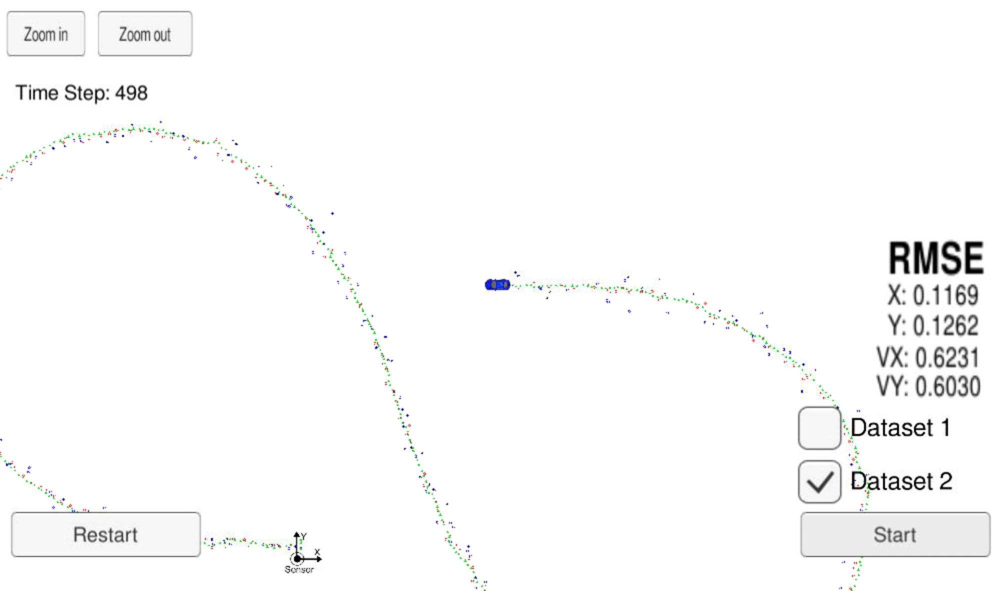

# Self-Driving Car Engineer Nanodegree Program

## Extended Kalman Filter 


In this project you will utilize a kalman filter to estimate the state of a moving object of interest with noisy lidar and radar measurements. Passing the project requires obtaining RMSE values that are lower than the tolerance outlined in the project rubric. 

This project involves the Term 2 Simulator which can be downloaded [here](https://github.com/udacity/self-driving-car-sim/releases).

## The project has the following dependencies

The project has the following dependencies (from Udacity's seed project):

- cmake >= 3.5
- make >= 4.1
- gcc/g++ >= 5.4
- Udacity's simulator.

For instructions on how to install these components on different operating systems, please, visit Udacity's seed project. As this particular implementation was done on Mac OS, the rest of this documentation will be focused on Mac OS. I am sorry to be that restrictive.

In order to install the necessary libraries, use the install-mac.sh.
## Basic Build Instructions

1. Clone this repo.
2. Make a build directory: `mkdir build && cd build`
3. Compile: `cmake .. && make` 
4. Run it: `./ExtendedKF `


## Running the Filter
From the build directory, execute `../ExtendedKF.`. The output should be:


```sh
Listening to port 4567
Connected!!!
```

## [Rubric points](https://review.udacity.com/#!/rubrics/748/view) 


# Compiling

Code compiles without any errors


### Accuracy

### px, py, vx, vy output coordinates must have an RMSE <= [.11, .11, 0.52, 0.52] when using the file: "obj_pose-laser-radar-synthetic-input.txt which is the same data file the simulator uses for Dataset 1"


The simulator provides two datasets. The difference between them are:

The direction the car (the object) is moving.
The order the first measurement is sent to the EKF. 
- On dataset 1, the LIDAR measurement is sent first. 
- On the dataset 2, the RADAR measurement is sent first.

Here is the simulator final state after running the EKL with dataset 1:


# The  results of the  various runs 

## Radar&Lidar measurements

| RMSE | Dataset 1 | Dataset 2 |
|------|-----------|-----------|
| P x  |  0.0974   |  0.0726   |
| P y  |  0.0885   |  0.0965   |
| V x  |  0.4517   |  0.4219   |
| V y  |  0.0404   |  0.4937   |


## Radar measurements


| RMSE | Dataset 1 | Dataset 2 |
|------|-----------|-----------|
| P x  |  11.1947   |  0.2709   |
| P y  |  8.1495   |  0.3857   |
| V x  |  9.1877   |  0.6530   |
| V y  |  6.9924   |  0.9227   |


## Lidar measurements


| RMSE | Dataset 1 | Dataset 2 |
|------|-----------|-----------|
| P x  |  0.1474   |  0.1169   |
| P y  |  0.1154   |  0.1262   |
| V x  |  0.6390   |  0.6231   |
| V y  |  0.5351   |  0.6030   |





## Following the Correct Algorithm

Your Sensor Fusion algorithm follows the general processing flow as taught in the preceding lessons.
The Kalman filter implementation can be found [kalman_filter.cpp](src/kalman_filter.cpp)     and it is used to predict at [src/FusionEKF.cpp](./src/FusionEKF.cpp#L158) line 158 and to update line 171 to 179.


## Your Kalman Filter algorithm handles the first measurements appropriately.
The first measurement is handled at   [src/FusionEKF.cpp](src/FusionEKF.cpp#L62)   src/FusionEKF.cpp from line 62 to line 118.


## Your Kalman Filter algorithm first predicts then updates.

The predict operation could be found at [src/FusionEKF.cpp](./src/FusionEKF.cpp#L158) line 158 and the update operation from line 171 to 179 of the same file.

## Your Kalman Filter can handle radar and lidar measurements.

Different type of measurements are handled in two places in [src/FusionEKF.cpp](src/FusionEKF.cpp#L62):

- For the first measurement from line 62 to line 118.
- For the update part from line 158 to 179.

# Code Efficiency

## Your algorithm should avoid unnecessary calculations.

An example of this calculation optimization is when the Q matrix is calculated [src/FusionEKF.cpp](src/FusionEKF.cpp#L142) line 144 to line 156.


